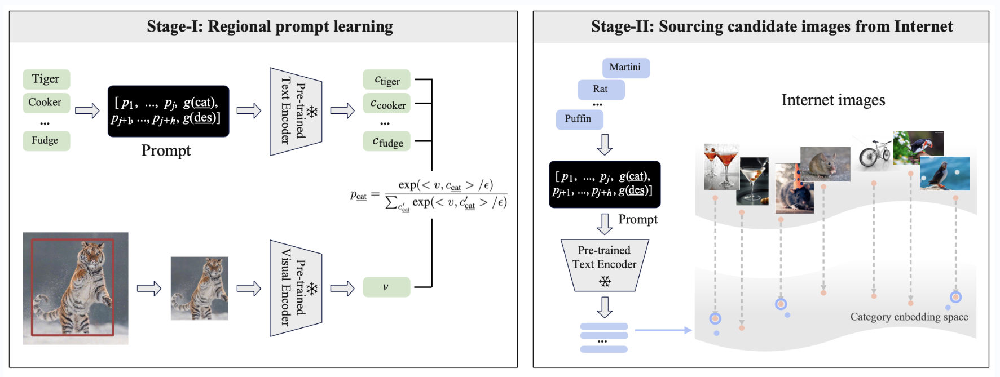

# Offline Regional Prompt Learning (RPL) of [PromptDet](https://github.com/fcjian/PromptDet)


## Prerequisites
- Dassl.pytorch
```python
# Clone this repo
git clone https://github.com/fcjian/RPL.git
cd RPL/Dassl.pytorch/

# Create a conda environment
conda create -y -n dassl python=3.8

# Activate the environment
conda activate dassl

# Install torch (requires version >= 1.8.1) and torchvision
# Please refer to https://pytorch.org/ if you need a different cuda version
conda install pytorch torchvision cudatoolkit=10.2 -c pytorch

# Install dependencies
pip install -r requirements.txt

# Install this library (no need to re-build if the source code is modified)
python setup.py develop
```

- CLIP
```python
# assume that you are under the root directory of this project
# and then install a few more packages required by CLIP
pip install -r requirements.txt
```

## Data preparation
```python
# stege-I: generate the object crops from LVIS v1.0
# training set
python tools/promptdet/save_object_crops.py --file-path data/lvis_v1/annotations/lvis_v1_train_seen.json --img-root data/lvis_v1 --save-root data/lvis_train_object_crops --num-thread 10
# val set
python tools/promptdet/save_object_crops.py --file-path data/lvis_v1/annotations/lvis_v1_val_seen.json --img-root data/lvis_v1 --save-root data/lvis_val_object_crops --num-thread 10
# correct the category names
mv data/lvis_train_object_crops/speaker_\(stero_equipment\) data/lvis_train_object_crops/speaker_\(stereo_equipment\)
mv data/lvis_val_object_crops/speaker_\(stero_equipment\) data/lvis_valhi_object_crops/speaker_\(stereo_equipment\)
mv data/lvis_train_object_crops/monitor_\(computer_equipment\)\ computer_monitor data/lvis_train_object_crops/monitor_\(computer_equipment\)_computer_monitor
mv data/lvis_val_object_crops/monitor_\(computer_equipment\)\ computer_monitor data/lvis_val_object_crops/monitor_\(computer_equipment\)_computer_monitor

# stege-II: random sample the image crops using symbolic links
# training set
python tools/promptdet/sample_image.py --source-root data/lvis_train_object_crops/ --target-root lvis_and_laion_data/imagenet/images/train --random-sample --num-images 200
# val set
python tools/promptdet/sample_images.py --source-root data/lvis_val_object_crops/ --target-root lvis_and_laion_data/imagenet/images/val --random-sample --num-images 200
# align the categories of the val set with the one of the training set
python tools/promptdet/align_val_with_train.py --train-root lvis_and_laion_data/imagenet/images/train/ --val-root lvis_and_laion_data/imagenet/images/val/
```
[0] *Annotation file of base categories: [lvis_v1_train_seen.json](https://drive.google.com/file/d/1dZQ5ytHgJPv4VgYOyjJerq4adc6GQkkd/view?usp=sharing) and [lvis_v1_val_seen.json](https://drive.google.com/file/d/1NVCFVRETJxAHwzyq81PQmUch-aYCK8cP/view?usp=sharing).* \
\
\
After training the prompt vectors, you can source the LAION images and update the training data iteratively:
```python
# stege-I: generate the category embeddings
python tools/promptdet/gen_category_embedding.py --model-file output/imagenet/RPL/vit_b32_ep6_promptdet_600shots/nctx1_csc_ctp/seed3/prompt_learner/model.pth.tar-6 --name-file promptdet_resources/lvis_category_and_description.txt --out-file promptdet_resources/lvis_category_embeddings.pt

# stege-II: install the dependencies, download the laion400m 64GB image.index and metadata.hdf5 (https://the-eye.eu/public/AI/cah/), and then retrival the LAION images
pip install faiss-cpu==1.7.2 img2dataset==1.12.0 fire==0.4.0 h5py==3.6.0
python tools/promptdet/retrieval_laion_image.py --indice-folder [laion400m-64GB-index] --metadata [metadata.hdf5] --text-features promptdet_resources/lvis_category_embeddings.pt --base-category --output-folder data/sourced_data --num-images 300

# stege-III: download the LAION images
python tools/promptdet/download_laion_image.py --base-category --output-folder data/sourced_data --num-thread 10

# stege-IV: sample the top-K sourced images using symbolic links
# need to delete the 'preprocessed.pkl' and 'split_fewshot' in 'lvis_and_laion_data/imagenet/' if they exist
python tools/promptdet/sample_image.py --source-root data/sourced_data --target-root lvis_and_laion_data/imagenet/images/train --laion-image --num-images 200
```
\
The directory structure should look like:
```
lvis_and_laion_data
|-- imagenet/
|   |-- classnames.txt
|   |-- images/
|   |   |-- train/
|   |   |-- val/
```

## Training
```
cd scripts
sh main.sh imagenet vit_b32_ep6 lvis_and_laion_data 1 600 # the last number shuold be greater than or equal to the maximum number of the training images of the category
```
For your convenience, we also provide the learned [prompt vectors](promptdet_resources/prompt_learner/lvis/model.pth.tar-6) and the [category embeddings](promptdet_resources/lvis_category_embeddings.pt) from the second iteration.

## Acknowledgement

Thanks [CoOp](https://github.com/KaiyangZhou/CoOp) and [Dassl.pytorch](https://github.com/KaiyangZhou/Dassl.pytorch) for the wonderful open source project!


## Citation

If you find PromptDet or RPL useful in your research, please consider citing:

```
@inproceedings{feng2022promptdet,
    title={PromptDet: Towards Open-vocabulary Detection using Uncurated Images},
    author={Feng, Chengjian and Zhong, Yujie and Jie, Zequn and Chu, Xiangxiang and Ren, Haibing and Wei, Xiaolin and Xie, Weidi and Ma, Lin},
    journal={Proceedings of the European Conference on Computer Vision},
    year={2022}
}
```
